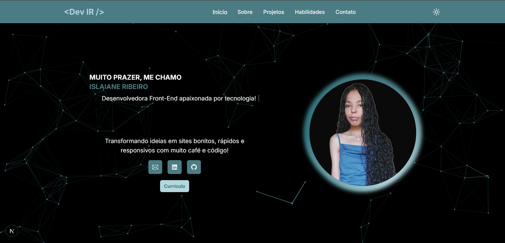
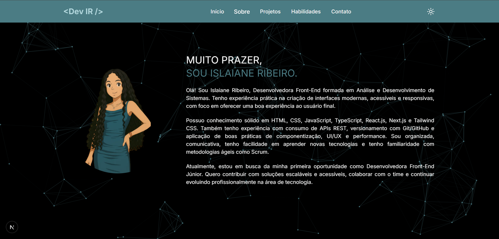
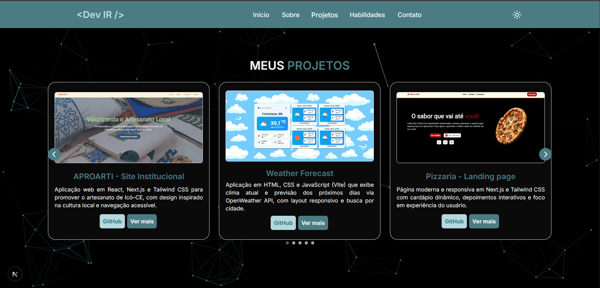
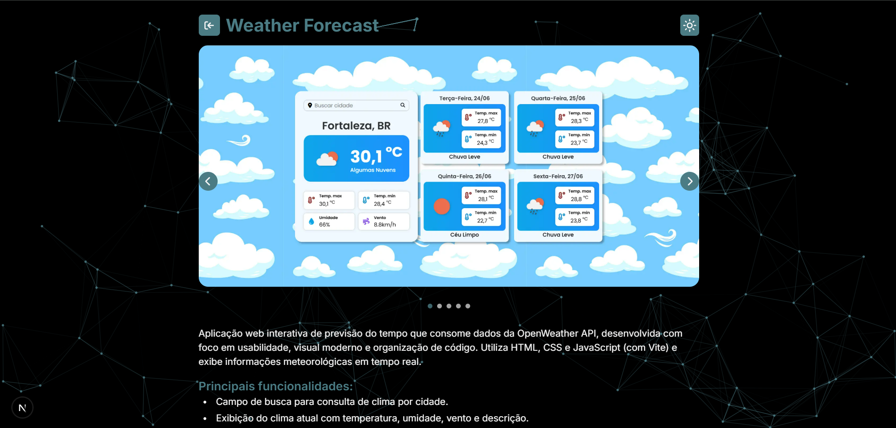
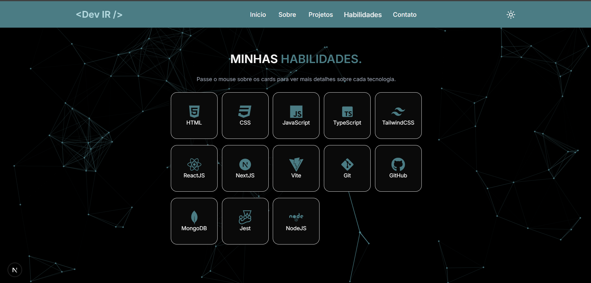
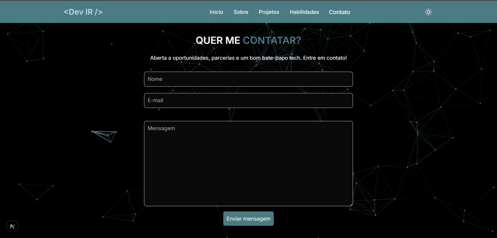

## 💻 Portfólio - Dev Front-End Islaiane Ribeiro

Portfólio web totalmente responsivo, com foco em acessibilidade, apresentando as seções Home, Sobre Mim, Projetos, Habilidades, Contato e páginas detalhadas para cada projeto. Desenvolvido com tecnologias modernas para oferecer uma experiência fluida e interativa.

🔗 **Acesse o portfólio online**: [https://portfolio-islaiane-ribeiro.vercel.app](https://portfolio-islaiane-ribeiro.vercel.app/)

---

## 🚀 Tecnologias Utilizadas

- **Next.js 15.3.4** — framework React para aplicações web;
- **React 19** — biblioteca para interfaces de usuário;
- **TypeScript** — tipagem estática para JavaScript;
- **Tailwind CSS 4** — estilização utilitária;
- **AOS** — animações on scroll;
- **Swiper** — carrossel responsivo;
- **React Icons** — ícones vetoriais;
- **TSParticles** — partículas animadas em background;
- **EmailJS** — envio de emails direto do frontend.

---

## 🌍 Funcionalidades

- Layout responsivo e acessível em todos os dispositivos;
- Seções: Home, Sobre Mim, Projetos, Habilidades, Contato;
- Páginas de detalhes para cada projeto;
- Animações suaves ao rolar a página (AOS);
- Formulário de contato com envio de e-mail via EmailJS;
- Carrossel de projetos com Swiper;
- Fundo animado com partículas usando TSParticles;
- Ícones vetoriais com React Icons.

---

## 📦 Instalação e Execução

1. Clone o repositório

```bash
git clone https://github.com/islaianeribeiro/portfolio-islaiane-ribeiro.git
```

2. Acesse a pasta do projeto

```bash
cd portfolio-islaiane-ribeiro
```

3. Instale as dependências

```bash
npm install
```

4. Crie o arquivo .env na raiz com as chaves do EmailJS:

```bash
NEXT_PUBLIC_EMAILJS_SERVICE_ID=seu_service_id
NEXT_PUBLIC_EMAILJS_TEMPLATE_ID=seu_template_id
NEXT_PUBLIC_EMAILJS_PUBLIC_KEY=sua_public_key
```

5. Execute a aplicação em modo de desenvolvimento

```bash
npm run dev
```

---

## 🧠 Organização do Código

Estrutura principal do projeto:

```
📁 public                  # Imagens e arquivos públicos
📁 src
├─ 📁 app                  # Páginas e layouts principais (Next.js App Router)
│  ├─ 📄 layout.tsx        # Layout geral da aplicação
│  ├─ 📄 page.tsx          # Página inicial (Home)
│  ├─ 📁 project           # Páginas de detalhes dos projetos
│  └─ 📄 globals.css       # Estilos globais específicos do app
├─ 📁 assets               # Imagens do projeto
├─ 📁 components           # Componentes reutilizáveis
├─ 📁 contexts             # Contextos React (tema)
├─ 📁 data                 # Dados estáticos (listas de projetos, skills, etc.)
├─ 📁 hooks                # Custom hooks
├─ 📁 types                # Tipagens TypeScript personalizadas
└─ 📄 .env                 # Variáveis de ambiente

```

---

## 🔐 Segurança

As chaves do EmailJS ficam no arquivo `.env` e são acessadas via variáveis de ambiente que começam com `NEXT_PUBLIC_` para serem usadas no cliente.

✅ O arquivo `.env` está listado no `.gitignore` para não vazar as chaves no repositório.

---

## 📸 Demonstração

Confira abaixo algumas capturas de tela do portfólio:

<div align="center">
  
  
  
  
  
  
  
</div>

---

## 📌 Status do Projeto

- ✔️ Projeto concluído e funcional;
- 🔧 Possível atualização para adicionar mais projetos e melhorias futuras;
- 🌐 Disponível em: [https://portfolio-islaiane-ribeiro.vercel.app](https://https://portfolio-islaiane-ribeiro.vercel.app)

---

## 👩‍💻 Desenvolvido por

**Islaiane Ribeiro**
Front-End Developer

🔗 LinkedIn - https://www.linkedin.com/in/islaianeribeiro

---

## 📝 Licença

MIT © 2025 — Sinta-se à vontade para usar como base para seus próprios projetos!
